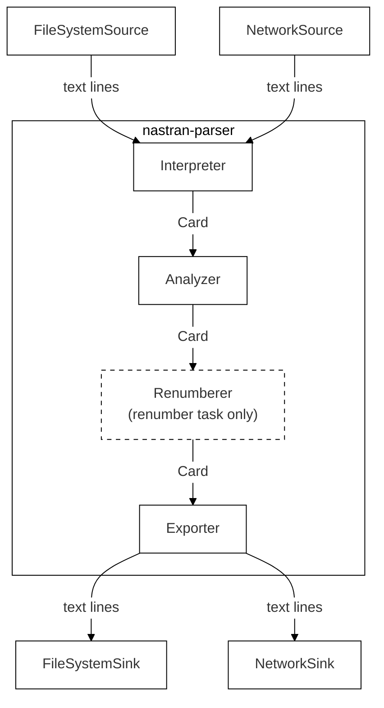

# Architectural Dossier
nastran-parser

---

## Actor/Action & Workflow

The actors, actions, and workflows are the basis for identifying the main modules and submodules of the system.

### Actors and Actions

Identified actors: **system only**

| # | Action |
|---|--------|
| 1 | Read BDF files from the local filesystem |
| 2 | Read BDF files from a network source (URL, REST endpoint) |
| 3 | Interpret NASTRAN card content from a stream and assign to internal data structures |
| 4 | Process BDF input as a data stream without loading the complete file into memory |
| 5 | Modify field values of NASTRAN cards |
| 6 | Write or stream BDF output to the local filesystem |
| 7 | Write or stream BDF output to a URL or REST API |
| 8 | Track card types and IDs encountered during processing and provide a file summary |

### Workflows

#### Workflow 1 — Read from data stream

**Stage 1 — Receive Stream**
- Accept incoming BDF data stream
- Determine task type: read-only
- Forward stream to interpreter

**Stage 2 — Interpret**
- Identify NASTRAN card type and format
- Extract field values
- Validate field types against card definition
- Assign values to internal card representation
- Record card type and ID in file summary
- Forward card to next stage

**Result:** Return file summary on stream completion

---

#### Workflow 2 — Renumber from data stream

**Stage 1 — Receive Stream**
- Accept incoming BDF data stream
- Determine task type: renumber
- Load renumbering ruleset
- Forward stream to interpreter

**Stage 2 — Interpret**
*(identical to Workflow 1, Stage 2)*

**Stage 3 — Renumber**
- Load ruleset defining target ID number ranges
- Extract card ID
- Generate next valid ID within the target range
- Record old → new ID mapping in lookup table
- Update card with new ID
- Forward card to next stage

**Stage 4 — Write to Sink**
- Accept card from previous stage
- Serialize and write/stream card to target (filesystem or URL)

**Result:** Return file summary (including renumbered ID mapping) on stream completion

---

*Further workflows will be added as requirements are defined.*

---

## Logical Design

From the actor/actions list we can derive the main software components inside the library
boundary and the external producers/consumers that connect to it.

Pipeline stages (inside nastran-parser boundary):

- **Interpreter** — assembles raw text lines into complete cards and instantiates typed card models
- **Analyzer** — transparent pass-through that accumulates the file summary
- **Renumberer** — remaps card IDs (renumber task only)
- **Exporter** — serialises card models back to BDF text lines

> **Note on Validator tester:** The original Excalidraw diagram shows a separate "Validator tester"
> stage. Based on the architectural decision to use Pydantic models, validation (type coercion,
> required-field checks, value constraints) is embedded inside the Interpreter at model-construction
> time. There is no separate runtime stage. The Excalidraw source should be updated to reflect this.

---

## Functional Breakdown

```mermaid
%%{init: {'theme': 'base', 'themeVariables': {'background': '#ffffff', 'primaryColor': '#ffffff', 'primaryBorderColor': '#000000', 'clusterBkg': '#ffffff', 'clusterBorder': '#000000', 'lineColor': '#000000', 'textColor': '#000000'}}}%%
flowchart TD
    NP["nastran-parser"]

    INT["interpreter"]
    ANL["analyzer"]
    RNB["renumberer"]
    EXP["exporter"]

    NP --> INT & ANL & RNB & EXP

    INT --> INT1["INT-1  assemble raw text lines\ninto complete cards"]
    INT --> INT2["INT-2  detect card format\n(small / large / free-field)"]
    INT --> INT3["INT-3  instantiate typed card models\n(field extraction + type validation)"]

    ANL --> ANL1["ANL-1  count cards by type"]
    ANL --> ANL2["ANL-2  determine numbering ranges\nper card type"]
    ANL --> ANL3["ANL-3  prepare file summary"]

    RNB --> RNB1["RNB-1  assign new numbering ranges\nbased on ruleset"]
    RNB --> RNB2["RNB-2  update card ID field"]
    RNB --> RNB3["RNB-3  populate old→new\nID lookup table"]

    EXP --> EXP1["EXP-1  serialise card models\nback to BDF text lines"]
    EXP --> EXP2["EXP-2  pass through\nunknown card types unchanged"]
```

> The **analyzer** runs on every BDF read. It profiles the file — counting cards and recording
> the ID ranges currently in use per card type — so the `FileSummary` is complete and usable
> as-is for a read-only task or as input to a subsequent renumber operation.

---

## Physical Design

*Diagrams will be added as Excalidraw exports. Source files in `architecture/diagrams/`.*
