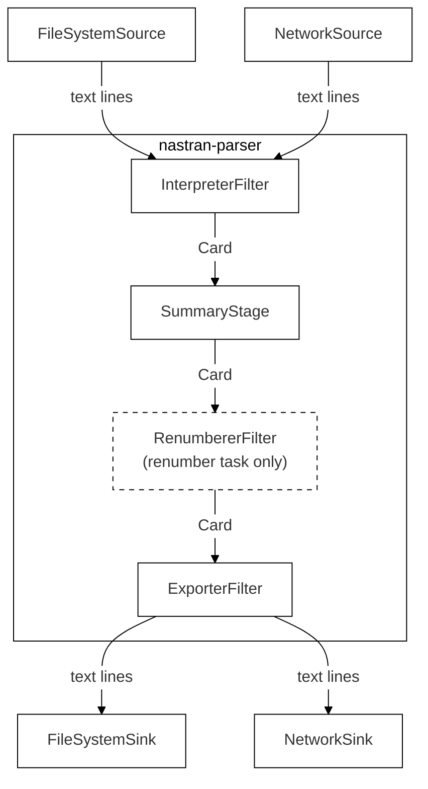

# Architectural Dossier
nastran-parser

---

## Actor/Action & Workflow

The actors, actions, and workflows are the basis for identifying the main modules and submodules of the system.

### Actors and Actions

Identified actors: **system only**

| # | Action |
|---|--------|
| 1 | Read BDF files from the local filesystem |
| 2 | Read BDF files from a network source (URL, REST endpoint) |
| 3 | Interpret NASTRAN card content from a stream and assign to internal data structures |
| 4 | Process BDF input as a data stream without loading the complete file into memory |
| 5 | Modify field values of NASTRAN cards |
| 6 | Write or stream BDF output to the local filesystem |
| 7 | Write or stream BDF output to a URL or REST API |
| 8 | Track card types and IDs encountered during processing and provide a file summary |

### Workflows

#### Workflow 1 — Read from data stream

**Stage 1 — Receive Stream**
- Accept incoming BDF data stream
- Determine task type: read-only
- Forward stream to interpreter

**Stage 2 — Interpret**
- Identify NASTRAN card type and format
- Extract field values
- Validate field types against card definition
- Assign values to internal card representation
- Record card type and ID in file summary
- Forward card to next stage

**Result:** Return file summary on stream completion

---

#### Workflow 2 — Renumber from data stream

**Stage 1 — Receive Stream**
- Accept incoming BDF data stream
- Determine task type: renumber
- Load renumbering ruleset
- Forward stream to interpreter

**Stage 2 — Interpret**
*(identical to Workflow 1, Stage 2)*

**Stage 3 — Renumber**
- Load ruleset defining target ID number ranges
- Extract card ID
- Generate next valid ID within the target range
- Record old → new ID mapping in lookup table
- Update card with new ID
- Forward card to next stage

**Stage 4 — Write to Sink**
- Accept card from previous stage
- Serialize and write/stream card to target (filesystem or URL)

**Result:** Return file summary (including renumbered ID mapping) on stream completion

---

*Further workflows will be added as requirements are defined.*

---

## Logical Design

From the actor/actions list we can derive the main software components inside the library
boundary and the external producers/consumers that connect to it.

Pipeline stages (inside nastran-parser boundary):

- **Interpreter filter** — assembles raw text lines into complete cards and instantiates typed card models
- **Summary stage** — transparent pass-through that accumulates the file summary
- **Renumberer filter** — remaps card IDs (renumber task only)
- **Exporter filter** — serialises card models back to BDF text lines

> **Note on Validator tester:** The original Excalidraw diagram shows a separate "Validator tester"
> stage. Based on the architectural decision to use Pydantic models, validation (type coercion,
> required-field checks, value constraints) is embedded inside the Interpreter at model-construction
> time. There is no separate runtime stage. The Excalidraw source should be updated to reflect this.

*Source: [architecture/diagrams/logical_design.excalidraw](diagrams/logical_design.excalidraw)*

---

## Functional Breakdown

### Module responsibility mapping

| Module | Purpose | Actor/Actions | Workflow steps | FRs |
|--------|---------|---------------|----------------|-----|
| `FileSystemSource` | Open a local BDF file; yield decoded text lines via generator | 1 | Accept stream (Stage 1) | FR-1 |
| `NetworkSource` | Open a URL/REST endpoint; yield decoded text lines via generator | 2 | Accept stream (Stage 1) | FR-2 |
| `PipelineFactory` | Accept task type + source; assemble ordered stage chain; return `(card_iterator, FileSummary)` | — | Determine task type; load ruleset; wire stages | FR-9 |
| `InterpreterFilter` | Assemble lines into complete cards incl. continuations; detect format; parse fields; instantiate typed Pydantic card model (validation embedded) | 3, 4 | Identify format; extract fields; validate; assign to model (Stage 2) | FR-3, FR-8 |
| `SummaryStage` | Transparent pass-through; records card type and ID into `FileSummary`; holds no card references after forwarding | 8 | Record card type + ID | FR-7 |
| `RenumbererFilter` | Map each card ID to next available ID in target range; update card field; record old→new mapping in `FileSummary` | — | Extract ID; generate new ID; record mapping; update card (Workflow 2, Stage 3) | FR-10, FR-11 |
| `ExporterFilter` | Convert each card model to BDF-formatted text lines; unknown card types pass through unchanged | — | Serialize card (Stage 4) | FR-5, FR-6 (serialisation) |
| `FileSystemSink` | Write text lines from ExporterFilter to a local file | 6 | Write to target (Stage 4) | FR-5 (I/O) |
| `NetworkSink` | Stream text lines from ExporterFilter to an HTTP endpoint via chunked transfer encoding | 7 | Stream to target (Stage 4) | FR-6 (I/O) |
| Card models (`Grid`, `Cquad4`, …) | Typed Pydantic models; one per card type; field mutation via direct attribute assignment, validated by Pydantic | 5 | — | FR-4 |
| `FileSummary` | Accumulates card type counts, individual card IDs, and (renumber only) old→new ID mapping during stream processing | 8 | Return summary on stream completion | FR-7, FR-11 |

*A component diagram (Excalidraw) will be added to `architecture/diagrams/` to visualise these relationships graphically.*

---

## Physical Design

*Diagrams will be added as Excalidraw exports. Source files in `architecture/diagrams/`.*
