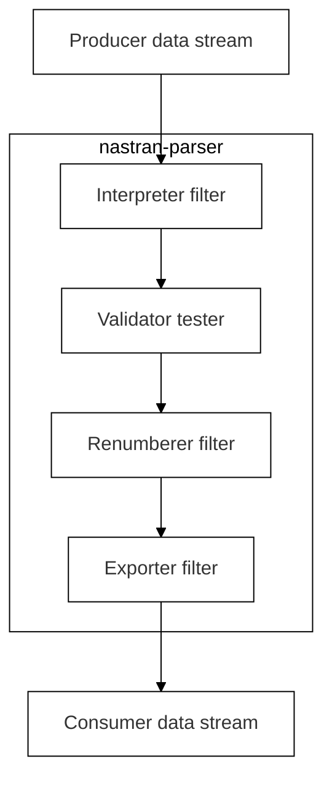

# Architectural Dossier
nastran-parser

---

## Actor/Action & Workflow

The actors, actions, and workflows are the basis for identifying the main modules and submodules of the system.

### Actors and Actions

Identified actors: **system only**

| # | Action |
|---|--------|
| 1 | Read BDF files from the local filesystem |
| 2 | Read BDF files from a network source (URL, REST endpoint) |
| 3 | Interpret NASTRAN card content from a stream and assign to internal data structures |
| 4 | Process BDF input as a data stream without loading the complete file into memory |
| 5 | Modify field values of NASTRAN cards |
| 6 | Write or stream BDF output to the local filesystem |
| 7 | Write or stream BDF output to a URL or REST API |
| 8 | Track card types and IDs encountered during processing and provide a file summary |

### Workflows

#### Workflow 1 — Read from data stream

**Stage 1 — Receive Stream**
- Accept incoming BDF data stream
- Determine task type: read-only
- Configure chunk size
- Forward stream to interpreter

**Stage 2 — Interpret**
- Identify NASTRAN card type and format
- Extract field values
- Validate field types against card definition
- Assign values to internal card representation
- Record card type and ID in file summary
- Forward card to next stage

**Result:** Return file summary on stream completion

---

#### Workflow 2 — Renumber from data stream

**Stage 1 — Receive Stream**
- Accept incoming BDF data stream
- Determine task type: renumber
- Load renumbering ruleset
- Configure chunk size
- Forward stream to interpreter

**Stage 2 — Interpret**
*(identical to Workflow 1, Stage 2)*

**Stage 3 — Renumber**
- Load ruleset defining target ID number ranges
- Extract card ID
- Generate next valid ID within the target range
- Record old → new ID mapping in lookup table
- Update card with new ID
- Forward card to next stage

**Stage 4 — Write to Sink**
- Accept card from previous stage
- Serialize and write/stream card to target (filesystem or URL)

**Result:** Return file summary (including renumbered ID mapping) on stream completion

---

*Further workflows will be added as requirements are defined.*

---

## Logical Design

From the actor / actions lists we can derive the main software components.

- Interpreter filter
- Validator tester
- Renumberer filter
- Exporter filter

*Source: [architecture/diagrams/logical_design.excalidraw](diagrams/logical_design.excalidraw)*

---

## Functional Breakdown

*Diagrams will be added as Excalidraw exports. Source files in `architecture/diagrams/`.*

---

## Physical Design

*Diagrams will be added as Excalidraw exports. Source files in `architecture/diagrams/`.*
